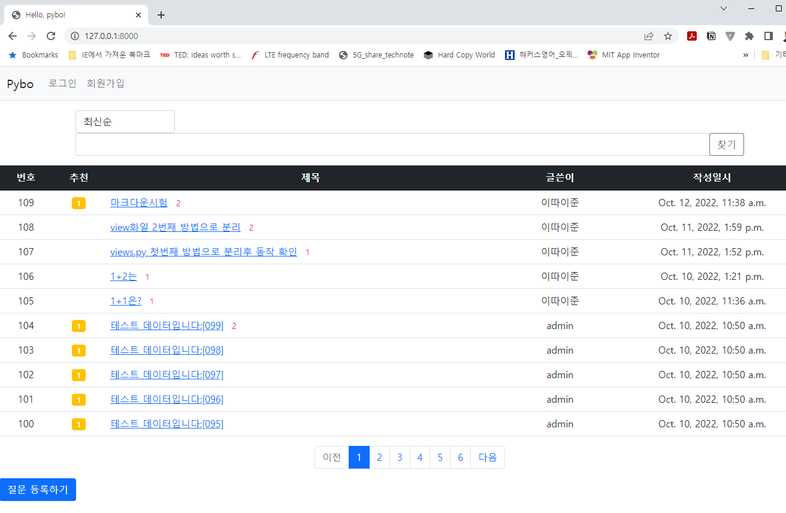

<h2># django to build a bulletin board, called "pybo"</h2>  

#1
After git cloning done, enter the command below in CLI to run codes in local host (127.0.0.1).     
<b> set DJANGO_SETTINGS_MODULE=config.settings.local </b>

Then, the following to create database files
<b> python manage.py makemigrations </b>  
<b> python manage.py migrate </b>

Then, run server
<b> python manage.py runserver </b> 

 

#2
To run this code on your cloud server, use the following  
<b> python manage.py runserver --settings=config.settings.prod </b> # on a cloud server such as AWS  

 
 Bulletin Board </img>
